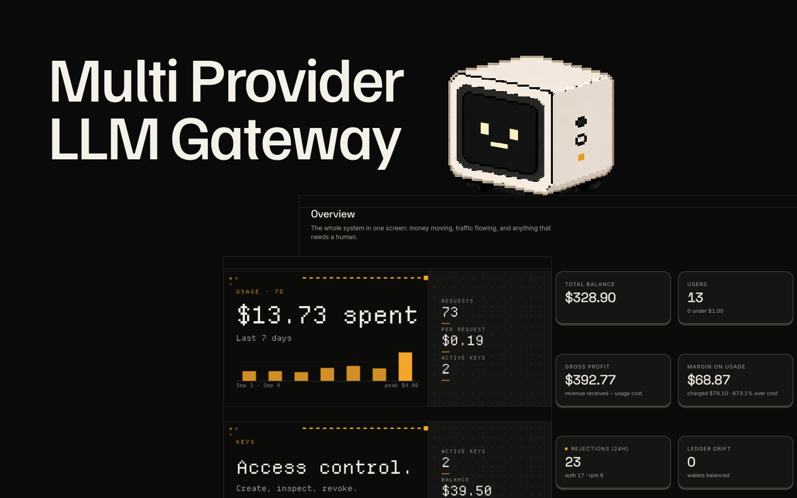
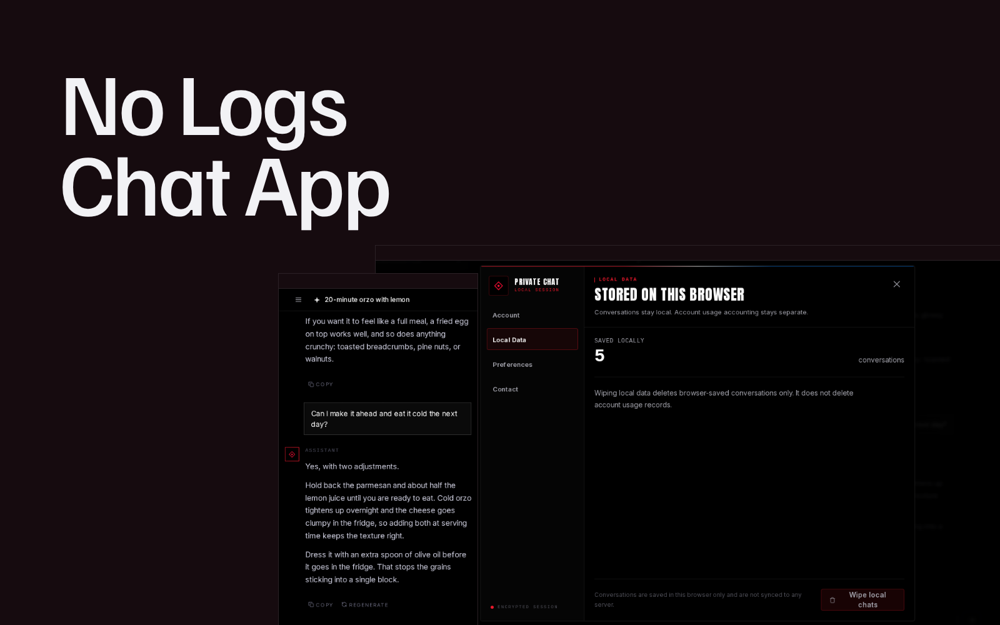
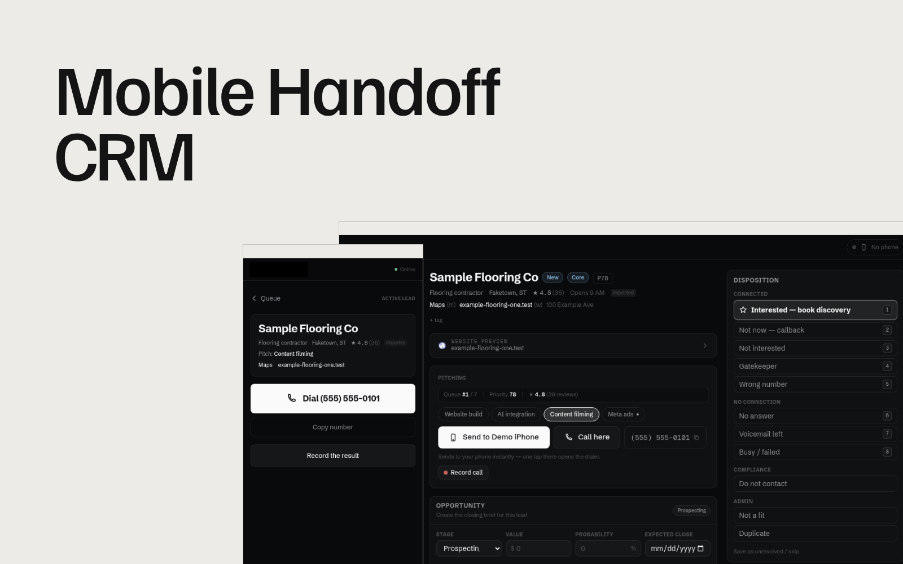

Sales operations first, then the software that ran it. Self-hosted, hand-built, shipped with agents.

## Projects

<table>
<tr>
<td width="33%" valign="top">

 <b>Multi Provider LLM Gateway</b>
 A gateway that speaks the exact wire APIs coding agents already talk, then forwards each request to a swappable upstream behind one adapter boundary.
</td>
<td width="33%" valign="top">

 <b>No Logs Chat App</b>
 A local-first chat client where the browser holds every conversation and the server keeps counters instead of content.
</td>
<td width="33%" valign="top">

 <b>Mobile Handoff CRM</b>
 A CRM where desktop lead work hands calls to a real mobile phone, then syncs call outcomes and follow-up state back to the operator dashboard.
</td>
</tr>
</table>

**Also built**

- Self Hosted Security Dashboard Next.js / React
- Service Business CRM Next.js / React
- Agent Browser API Node.js / Express

## Experience

NOW

I build internal tools and AI plumbing, for a company in Scotland and for myself.

| Years | Role | Where |
| --- | --- | --- |
| 2024 to now | Software and IT, project based | MPH Boilers, remote |

BEFORE

I ran field sales teams and built the reporting they ran on.

| Years | Role | Where |
| --- | --- | --- |
| 2025 to 2026 | Field marketing manager | Pinnacle Exteriors |
| 2023 to 2025 | Field marketing manager | Home Genius Exteriors |

UNDER IT

Four years of web and networking school, and a habit of fixing the workflow instead of working around it.

| Years | Role | Where |
| --- | --- | --- |
| 2019 to 2023 | Web design and development | Technical high school, Pennsylvania |

IPVM video surveillance certificate, 2023. SkillsUSA Pennsylvania state finals, second place, 2023.

## Writing

- [Hello, world](https://skev.in/#/blog/hello-world)

More on the [blog](https://skev.in/#/blog).

## Say hello

[hire-me@skev.in](mailto:hire-me@skev.in)

[skev.in](https://skev.in) / [LinkedIn](https://www.linkedin.com/in/skev1n)
