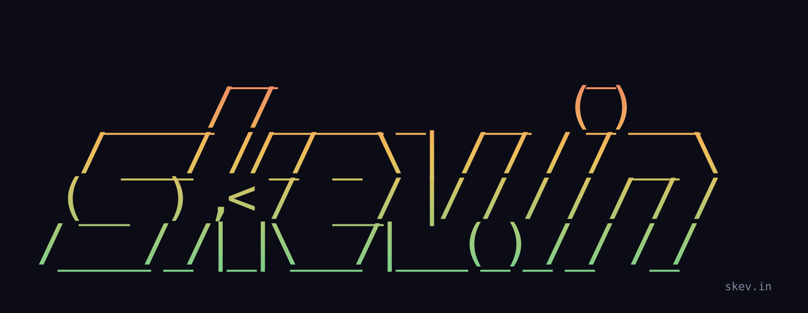

<table>
<tr>
<td width="200" valign="top">
<picture>
  <source media="(prefers-color-scheme: dark)" srcset="assets/portrait-dark.png">
  
</picture>
</td>
<td width="760" valign="top">

**Kevin Santiago**

I build internal tools and AI plumbing, for a company in Scotland and for myself. Before that I ran field sales teams and built the reporting they ran on, which is how the software habit started. Four years of web and networking school under all of it.

[skev.in](https://skev.in) / [hire-me@skev.in](mailto:hire-me@skev.in) / [LinkedIn](https://www.linkedin.com/in/skev1n)

</td>
</tr>
</table>

## What I build

**[Multi Provider LLM Gateway](https://skev.in/#/projects/multi-provider-llm-gateway)**
One endpoint for every provider I use. It speaks the wire APIs coding agents already talk and forwards each request to a swappable upstream behind one adapter boundary. The decision that matters is how it fails: a stream that ends without its terminal frame is an error, never a short success, because an agent handed a truncated tool call with no error signal acts on it instead of retrying.
Bun / TypeScript / Fastify / Next.js / Postgres / Drizzle / Redis / Zod

**[No Logs Chat App](https://skev.in/#/projects/no-logs-chat-app)**
A chat client where the browser holds every conversation and the server keeps counters instead of content. There is no request logger, no error tracker and no session replay, because a capability that is absent is a stronger promise than a sampling rate set to zero. The cost is real and I say so: you reason about the system from source instead of observing it.
Next.js 16 / React 19 / TypeScript / Tailwind v4 / PocketBase / Zod / DOMPurify

**[Mobile Handoff CRM](https://skev.in/#/projects/mobile-handoff-crm)**
Desktop lead work that hands the call to the operator's own phone, then syncs the outcome back to the dashboard. A browser cannot dial a number, so the handoff is a push to the paired device and a tel: link the operator taps themselves. A tapped dial is telemetry, not a call record: only a recorded disposition moves the lead, and that write is one Postgres transaction so the pipeline can never contradict itself.
Next.js / React / TypeScript / Supabase / Postgres / RLS / Web Push / Bun

**Self Hosted Security Dashboard**
Firewall, SSH, container, network and resource telemetry for a host, in one read-only view with severity and evidence attached. It never changes the machine. It prints the exact remediation command and leaves the decision to me, which keeps diagnosis separate from privileged action, and a collector that cannot answer fails soft instead of taking the page with it.
Next.js / React / TypeScript / SWR / Recharts / Node.js / Linux

**Service Business CRM**
Intake, quotes, scheduled work, recurring plans, documents and follow-up for a business that was running all of it across disconnected tools. The data is shaped around the customer and job lifecycle rather than around screens, so a new view reads the records that already exist instead of quietly starting a second source of truth.
Next.js / React / TypeScript / Convex / Clerk / React PDF / Object storage

**Agent Browser API**
Browser control for automation agents over a REST API: isolated sessions, navigation, input, screenshots, extraction, downloads and traces. It answers with a compact accessibility snapshot and stable element references instead of raw page markup, so responses stay small and every action target can be validated afterwards against the evidence it captured.
Node.js / Express / Playwright Core / OpenAPI / Prometheus

## How I work

Hand-built over templates. Plain CSS, no starter kit, no component library I did not choose on purpose.

Self-hosted where it counts. My own boxes, my own deploys, fonts and assets served from them, nothing phoning home.

Ship with agents, then write down what happened. The write-up outlives the branch.

## Writing

[Hello, world](https://skev.in/#/blog/hello-world), and the rest on the [blog](https://skev.in/#/blog).
